<div align="center">
<a name="readme-top"></a>

# ⛵ Harbor — Mobile & TV

### The Harbor experience, rebuilt natively for iPhone, iPad, Android, and Android TV.

A ground-up Flutter client for the Stremio ecosystem: a native player, the stream-ranking engine, Live TV with a real EPG, anime, an addon appstore, casting, kids mode, and a full TV-remote experience — one codebase that is a phone app, a tablet app, and a 10-foot living-room app at once.

<br/>


&nbsp;

&nbsp;

&nbsp;


<br/>

[Overview](#overview) &middot; [Screenshots](#screenshots) &middot; [Feature tour](#feature-tour) &middot; [Platforms](#platforms--responsive-design) &middot; [Build](#build--run) &middot; [Architecture](#architecture) &middot; [FAQ](#faq)

</div>

<br/>

<p align="center">
  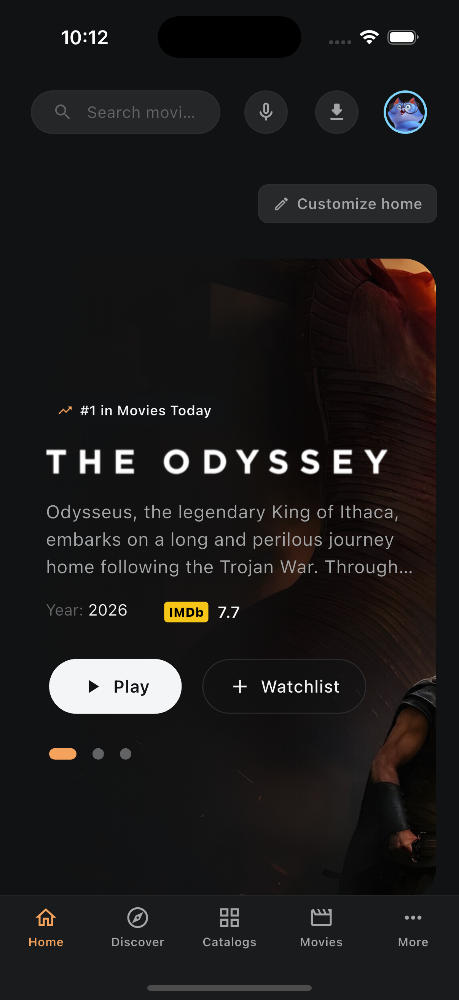
  &nbsp;&nbsp;
  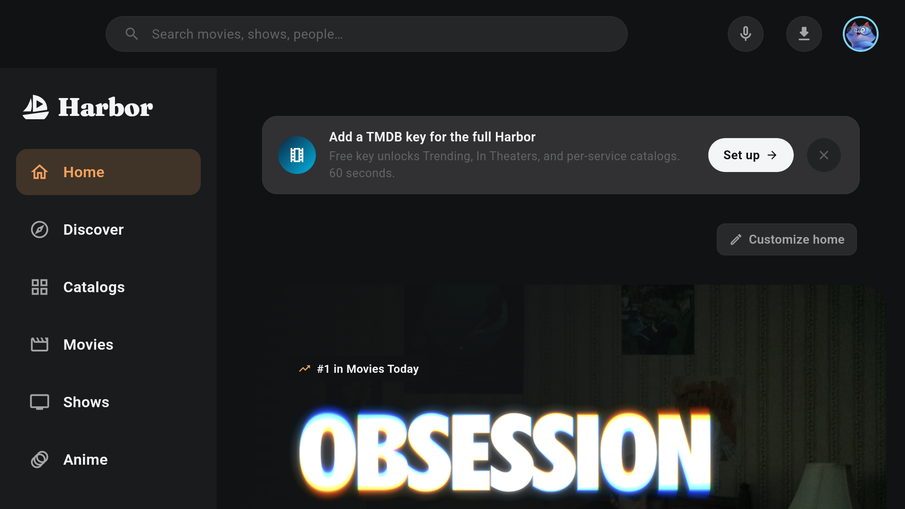
</p>
<p align="center"><sub>Harbor on iPhone and Android TV — the same rotating hero, Continue Watching, and full-width rails, laid out for each form factor. Works on Cinemeta out of the box; richer with a free TMDB key.</sub></p>

<br/>

> [!IMPORTANT]
> Harbor is a media player and a client for the open Stremio addon protocol. It hosts, indexes, and ships **no media**, and it bundles **no content addons**. You bring your own addons and sources. See the [Disclaimer](#disclaimer).

<br/>

<details>
<summary><kbd>Table of contents</kbd></summary>

<br/>

- [Overview](#overview)
- [Screenshots](#screenshots)
- [Feature tour](#feature-tour)
  - [Rooms and views](#rooms-and-views)
  - [The stream engine](#the-stream-engine)
  - [The player](#the-player)
  - [Casting and picture-in-picture](#casting-and-picture-in-picture)
  - [Live TV and Multiview](#live-tv-and-multiview)
  - [Anime](#anime)
  - [Addons](#addons)
  - [Kids mode and profiles](#kids-mode-and-profiles)
  - [Ratings, awards, and metadata](#ratings-awards-and-metadata)
  - [Integrations and sync](#integrations-and-sync)
  - [Themes and customization](#themes-and-customization)
  - [Phone companion](#phone-companion)
  - [Quality-of-life extras](#quality-of-life-extras)
- [Platforms and responsive design](#platforms--responsive-design)
- [Privacy](#privacy)
- [Requirements](#requirements)
- [Build and run](#build--run)
- [Configuration](#configuration)
- [Architecture](#architecture)
- [Roadmap](#roadmap)
- [FAQ](#faq)
- [Contributing](#contributing)
- [Disclaimer](#disclaimer)
- [Acknowledgements](#acknowledgements)
- [License](#license)

</details>

<br/>

## Overview

**Harbor Mobile & TV** brings the Harbor experience to the devices you actually watch on. It is not a webview wrapper and it does not embed the desktop app — it is a from-scratch native client written in Flutter, sharing Harbor's design language and behavior while adapting fully to touch and to the TV remote.

Out of the box it runs on Cinemeta. Add a free [TMDB](https://www.themoviedb.org/settings/api) key and it blossoms into a full companion for discovering and watching content, with Trending, In-Theaters, per-service catalogs, and richer metadata.

- **A native player.** libmpv (via `media_kit`) decodes virtually any codec and container, with HDR passthrough, skip intro/outro, Anime4K upscaling shaders, subtitle styling, A/B loop, sleep timer, and playback-speed control. On platforms that prefer it, Harbor also drives the OS-native engine (ExoPlayer / AVPlayer) for the smoothest hardware path.
- **Intelligent stream ranking.** Harbor parses every stream, filters out scams and fakes, scores real sources by quality/size/seeders/cache, and surfaces the best first — with a per-season source lock and "remember my source" so the next episode just plays.
- **Everything is a room.** Home, Discover, Movies, Shows, Anime, Live TV, Calendar, My Library, Addons, and Settings — the same ten primary rooms as desktop, arranged as a bottom nav on a phone and a focusable side rail on a tablet or TV.
- **A real addon appstore.** Install and manage Stremio addons without leaving the app, merging the Stremio community API with community ratings and recommendations.
- **Built for the couch and the commute.** Full D-pad / TV-remote focus traversal, picture-in-picture, offline downloads, a voice search, and a phone companion for typing URLs and signing in without pecking at a remote.

<p align="right"><a href="#readme-top">&#9650; back to top</a></p>

## Screenshots

Captured live from the iOS Simulator and Android emulators.

### One app, every form factor

| iPhone | iPad | Android TV |
| :---: | :---: | :---: |
|  | 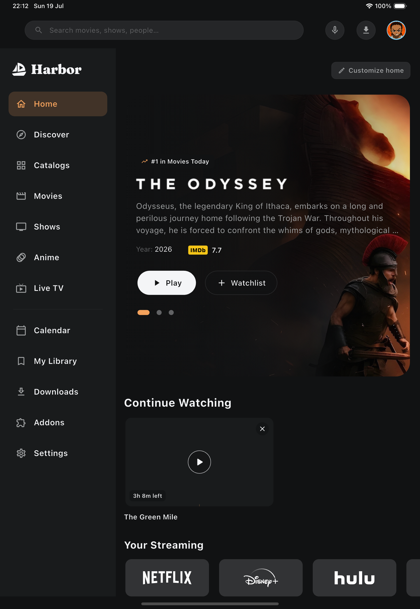 |  |
| Bottom navigation, single pane | Persistent side rail, two panes | 10-foot rail with D-pad focus |

### Feature tour

| Home | Discover | Movies |
| :---: | :---: | :---: |
| 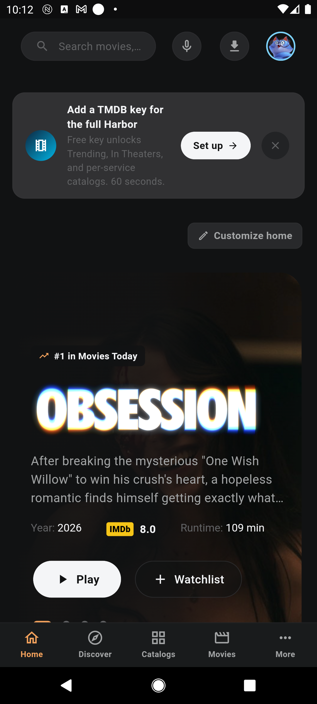 | 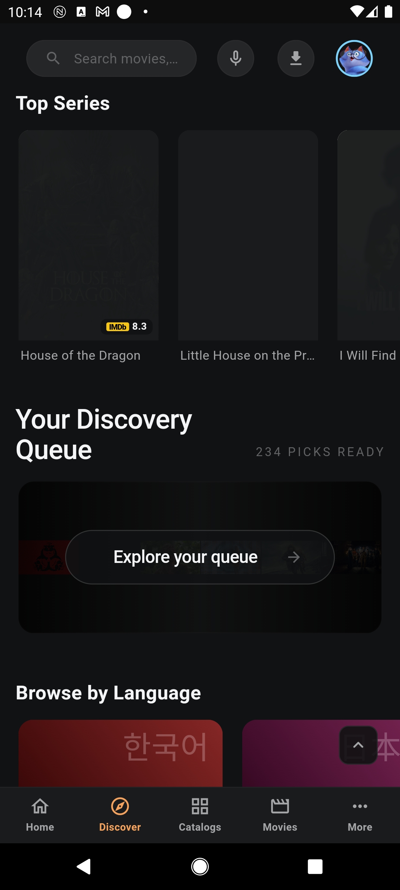 | 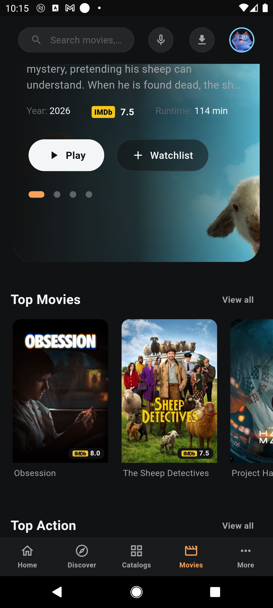 |
| Rotating hero, Continue Watching, streaming rails | Taste-scored spotlight, Discovery Queue, browse by genre/language | Featured hero + Top Movies / Top Action rails |

| Detail | Search | Settings |
| :---: | :---: | :---: |
| 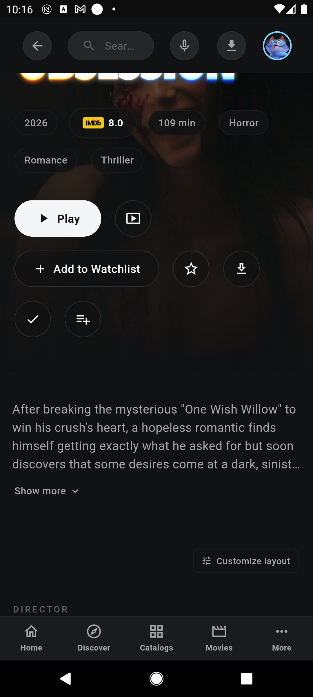 | 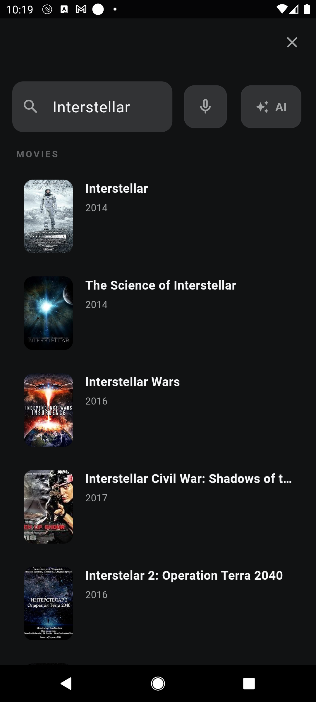 | 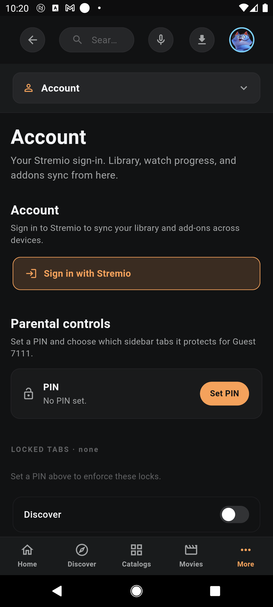 |
| Ratings, actions, synopsis, customizable layout | Top match, Movies / Series / People, voice, recents | Account, parental controls, per-category settings |

| Addons | Android TV — catalog |
| :---: | :---: |
| 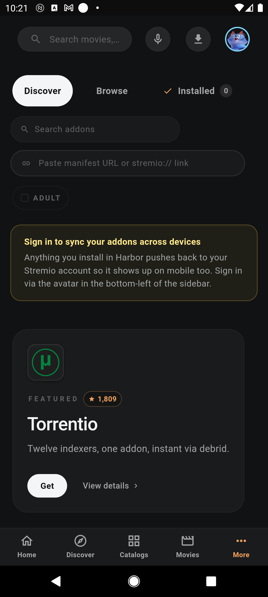 | 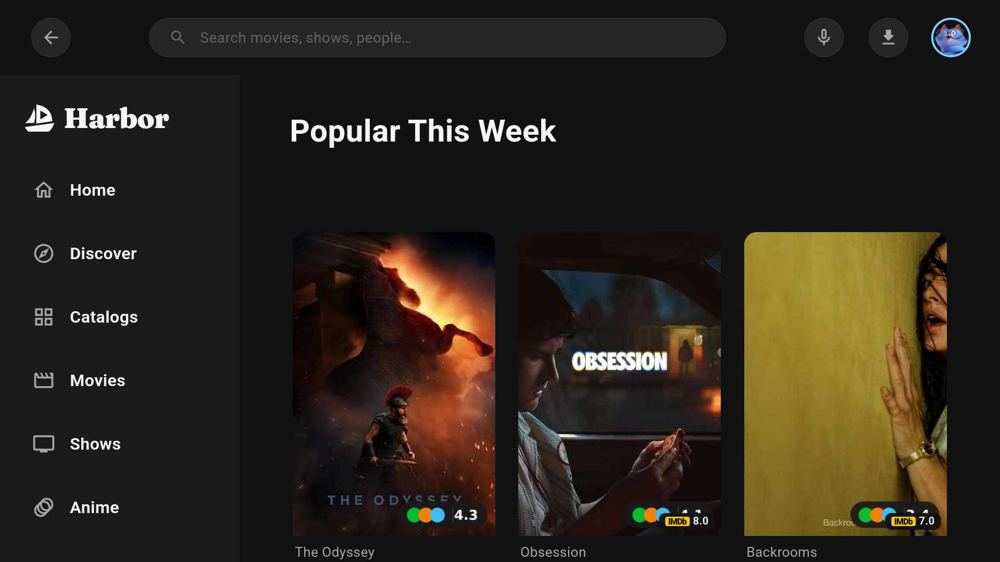 |
| Discover / Browse / Installed, paste-a-manifest, featured picks | Poster cards with rating badges in the 10-foot layout |

<p align="right"><a href="#readme-top">&#9650; back to top</a></p>

## Feature tour

### Rooms and views

Ten primary rooms — **Home, Discover, Movies, Shows, Anime, Live TV, Calendar, My Library, Addons, Settings** — plus Downloads, Kids mode, and per-title Detail and Person pages. Home leads with a rotating hero, a Continue-Watching engine that advances you to the next aired episode, your streaming-service rails, and fully customizable, reorderable rows. Discover adds a taste-scored spotlight, a swipeable Discovery Queue, and browse-by-genre / browse-by-language tiles. Calendar pulls upcoming releases from TMDB, your library, and Trakt.

### The stream engine

When you press Play, Harbor fetches sources from your installed addons, **parses every result** (quality, codec, HDR, size, seeders, cached/debrid status, language), filters junk, and ranks the trustworthy sources first. You can switch quality on the fly, confirm untrusted sources, filter by language/facets, and let Harbor **remember your source** and **lock a source per season** so the next episode plays without a second trip through the picker.

### The player

A native player built for real files:

- **libmpv** decoding via `media_kit` for near-universal codec/container support, plus an OS-native engine path (ExoPlayer / AVPlayer) where it is the better fit.
- HDR passthrough, hardware decoding, and resolution/quality readouts.
- **Skip intro / outro**, **Anime4K** upscaling shaders, crop/aspect modes, audio-track and subtitle selection with **subtitle styling**, **A/B loop**, **playback-speed** control with custom speeds, and a **sleep timer**.
- A polished seek bar, an **Up-Next** episodes panel, and a subtitle-sync bar.
- Every in-player control is reachable by touch **and** by the TV remote.

### Casting and picture-in-picture

Cast to **Chromecast**, hand off to **AirPlay** on Apple devices, and pop the video into **picture-in-picture** to keep watching while you browse. A now-playing bridge wires the OS media session (lock-screen / notification controls) on both platforms.

### Live TV and Multiview

Bring an **M3U** or **Xtream Codes** playlist and Harbor builds a real **EPG grid guide** with favorites, catchup, an RTL-aware channel organizer, and a curated Live Home. **Multiview** plays several channels at once in a grid. Switch channels from the guide without leaving the player.

### Anime

A first-class anime experience: Jikan/Kitsu-backed catalogs, franchise and season/episode de-duplication and merge, fillers, dub badges, top-picks and rank cards, plus **AniList** and **MyAnimeList** rails and sync.

### Addons

A bespoke in-app appstore: **Discover**, **Browse**, and **Installed** tabs, addon search, "paste a manifest URL or `stremio://` link", featured picks, and one-tap install — merging the Stremio community index with community ratings and recommendations. Anything you install syncs back to your Stremio account, so it shows up on your other devices too.

### Kids mode and profiles

Netflix-style **per-platform profiles** with a full-screen picker, plus a **kid-safe mode** that swaps in a curated, safe detail page and browse experience and strips unsafe sources. **Parental controls** gate chosen tabs behind a PIN.

### Ratings, awards, and metadata

Poster cards and detail pages surface ratings from **IMDb, TMDB, MDBList, Rotten Tomatoes, Metacritic, Letterboxd,** and **Trakt**, with batched score fetching and per-card badge limits you control. Award data (Oscars, BAFTA, Cannes, SAG, and more) and rich cast/crew metadata round out the detail pages.

### Integrations and sync

Native sync and sign-in for **Trakt, Simkl, AniList, MyAnimeList,** and **Letterboxd**, plus TMDB, OMDB, Fanart.tv, RPDB and MDBList metadata sources. A **Wrapped** year-in-review summarizes your watching.

### Themes and customization

A dark, brand-consistent theme with a custom theme editor, customizable Home rows, customizable Detail layout, configurable rating badges, and per-platform behavior toggles.

### Phone companion

Typing on a TV remote is painful. Harbor's **companion** lets you enter URLs, API keys, and sign-ins from your phone over an **end-to-end-encrypted LAN pairing** (ed25519 + X25519, device/PIN QR). Scan a QR on the TV, type on your phone, done.

### Quality-of-life extras

Offline **Downloads**, **voice search**, natural-language search, deep links, an in-app **bug report** with diagnostics, localized UI (including Arabic with proper RTL shaping and Portuguese), UI sound effects, and a back-to-top affordance on long pages.

<p align="right"><a href="#readme-top">&#9650; back to top</a></p>

## Platforms and responsive design

One widget tree, three idioms. Harbor keys its **chrome** (side rail vs. bottom navigation) off the device's shortest side, and its **content layout** off the width actually available to the content pane — so every screen reflows correctly no matter the size or orientation.

| Device | Chrome | Notes |
| --- | --- | --- |
| **iPhone** | Bottom navigation | Single pane, touch-first |
| **iPad** | Side rail, two panes | Split-view aware; portrait and landscape |
| **Android phone** | Bottom navigation | Stays phone-chrome in both orientations |
| **Android tablet** | Side rail, two panes | Same two-pane layout as iPad at matching widths |
| **Android TV** | Focusable side rail | Overscan-safe gutters, 10-foot type |

**TV-remote support is first-class.** Directional (D-pad) focus traversal is wired throughout — rows, grids, the player overlays, dialogs, and forms. Focus and activation are separate actions; focusing an input never starts editing it, and the remote is never trapped inside a text field.

<p align="right"><a href="#readme-top">&#9650; back to top</a></p>

## Privacy

Harbor talks only to the services you configure (your addons, your debrid provider, your IPTV playlist, and the metadata providers you enable). Secrets — API keys, service tokens, debrid credentials — are stored in the platform keychain / keystore, never in plaintext. The phone companion pairs over your **local network** with end-to-end encryption; nothing routes through a central server.

<p align="right"><a href="#readme-top">&#9650; back to top</a></p>

## Requirements

- **Flutter** 3.10+ (Dart SDK `^3.10.4`)
- **iOS / iPadOS**: Xcode 15+, CocoaPods, a Simulator or a device
- **Android / Android TV**: Android SDK, an emulator or a device (min SDK 21)

## Build & run

```bash
cd clients

# fetch dependencies
flutter pub get

# run on a connected device or simulator/emulator
flutter run

# target a specific device
flutter devices
flutter run -d <device-id>
```

Release builds:

```bash
# Android (universal APK)
flutter build apk --release

# Android App Bundle
flutter build appbundle --release

# iOS (then archive in Xcode)
flutter build ios --release
```

> The app icon and native splash are generated from `assets/brand/` via `flutter_launcher_icons` and `flutter_native_splash`. Regenerate with `dart run flutter_launcher_icons` and `dart run flutter_native_splash:create` after changing the brand art.

## Configuration

Everything is configured in-app under **Settings** — no environment files required:

- **TMDB key** — unlocks Trending, In-Theaters, and per-service catalogs (free; 60 seconds to set up). Enter it by hand or paste it from your phone via the companion.
- **Addons** — install from the in-app appstore, or paste a manifest URL / `stremio://` link. Sign in with Stremio to sync installed addons across devices.
- **Debrid** — Real-Debrid / Premiumize / AllDebrid credentials for cached, instant sources.
- **Live TV** — add an M3U or Xtream Codes playlist (and an optional XMLTV EPG).
- **Integrations** — sign in to Trakt, Simkl, AniList, MyAnimeList, and Letterboxd.

<p align="right"><a href="#readme-top">&#9650; back to top</a></p>

## Architecture

A layered Flutter app with a clear separation between framework-independent domain logic, app-level wiring, and the UI.

```
clients/
├── lib/
│   ├── main.dart            # entrypoint
│   ├── app/                 # Riverpod providers, controllers, app wiring
│   ├── core/                # Result, HTTP transports, storage, safe URL launch
│   ├── design/              # design tokens, themes, layout idiom, focus system, shared widgets
│   ├── domain/              # framework-independent logic: catalogs, streams, player,
│   │                        #   addons, iptv, anime, ratings, library, integrations, ...
│   └── features/            # screens: home, discover, catalog, detail, player,
│                            #   live, search, library, settings, kids, addons, ...
├── android/                 # Android + Android TV host (Kotlin: MainActivity, media-session bridge)
├── ios/                     # iOS / iPadOS host (Swift: AppDelegate, AirPlay/now-playing)
└── assets/                  # brand, avatars, flags, badges, award data, fonts, Lottie
```

**Key choices**

- **State** — [Riverpod](https://riverpod.dev) 3.x. Domain logic lives outside widgets as providers so it stays testable and reusable.
- **Navigation** — `go_router`, with a responsive shell that swaps between a side rail and a bottom nav by device idiom.
- **Player** — `media_kit` (libmpv) for universal decoding, with an OS-native engine path (ExoPlayer / AVPlayer) selected per platform; `flutter_chrome_cast` for Chromecast and a native AirPlay bridge on iOS.
- **Storage** — `hive_ce` for local data; `flutter_secure_storage` (Keychain / Keystore) for all secrets.
- **Networking** — `dio`, with cooperative abort signals and typed transports.
- **Companion crypto** — `cryptography` + `ed25519_edwards` for the end-to-end-encrypted LAN pairing; `qr_flutter` for the pairing QR.
- **Responsive model** — a single `Idiom` layer keys chrome off the device's shortest side and content off the pane width, reproducing the web layout's breakpoints while adapting to phone, tablet, and TV.

<p align="right"><a href="#readme-top">&#9650; back to top</a></p>

## Roadmap

- Deeper per-platform player tuning (media3 / AVPlayer HDR paths, motion interpolation)
- Broader watch-party and DVR parity with the desktop client
- More localized catalogs and UI languages
- Continued 1:1 parity passes against the desktop rooms

## FAQ

**Does it need the desktop Harbor app?**
No. This is a standalone native client. It speaks the same Stremio addon protocol and can sync your addons/library through your Stremio account.

**Does it come with content?**
No. Harbor ships no media and bundles no content addons. You add your own addons and sources.

**Do I need a TMDB key?**
No — it runs on Cinemeta out of the box. A free TMDB key unlocks Trending, In-Theaters, and richer catalogs/metadata.

**Which devices are supported?**
iPhone, iPad, Android phones and tablets, and Android TV. Layout and input adapt automatically to each.

**Where are my keys stored?**
In the platform keychain/keystore — never in plaintext, never in the git history.

## Contributing

Issues and pull requests are welcome. Please:

- Read the relevant files before changing them, and follow the existing naming and style.
- Keep changes focused on the task; avoid unrelated refactors.
- Keep platform-specific behavior isolated, and test on the affected platform when you can (`flutter analyze` and a run on a simulator/emulator at minimum).
- Do not silently change user-facing behavior, and never expose secrets, tokens, private URLs, or user data.

<p align="right"><a href="#readme-top">&#9650; back to top</a></p>

## Disclaimer

Harbor is a media player and a client for the open Stremio addon protocol. **It hosts, indexes, and ships no media, and it bundles no content addons.** You bring your own addons and sources, and you are responsible for what you install and stream. Follow the laws of your jurisdiction. Harbor is an independent, open-source project and is not endorsed by or affiliated with Stremio Ltd.

## Acknowledgements

Built with [Flutter](https://flutter.dev), [Riverpod](https://riverpod.dev), and [media_kit](https://github.com/media-kit/media-kit) (libmpv), on top of the open [Stremio](https://www.stremio.com) addon ecosystem. Metadata and ratings from TMDB, Cinemeta, OMDB, Fanart.tv, RPDB, MDBList, and friends. Thank you to the Harbor community.

## License

MIT — same as the main Harbor project. See the [LICENSE](../LICENSE) at the repository root.

<p align="right"><a href="#readme-top">&#9650; back to top</a></p>
