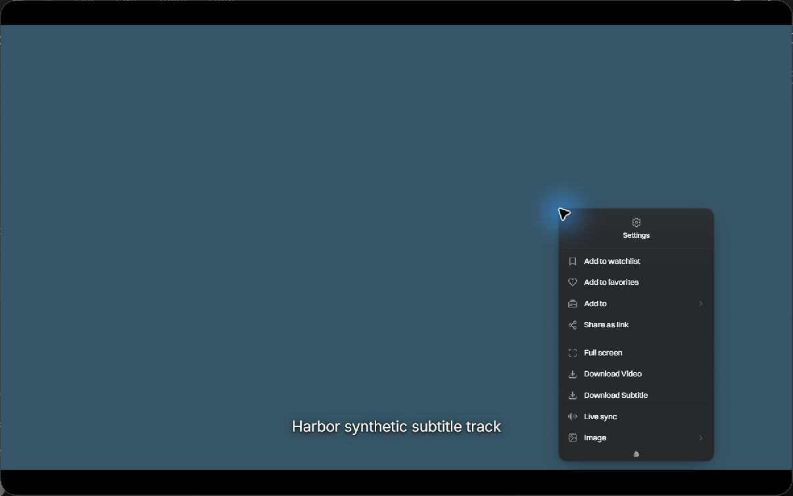
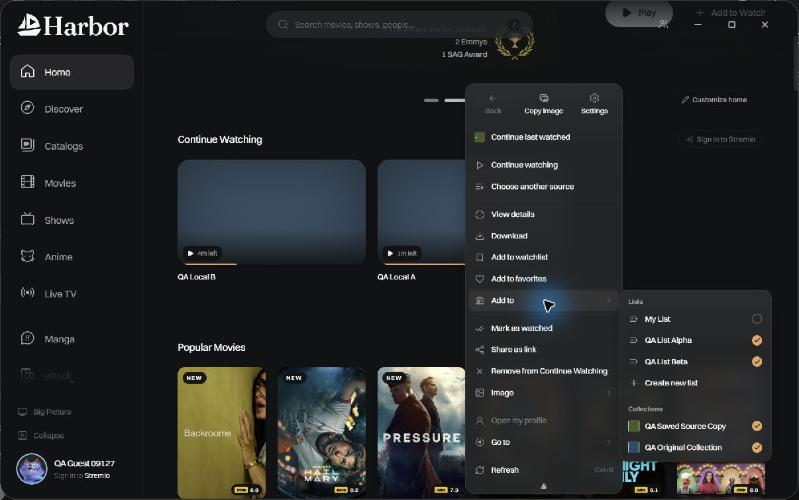
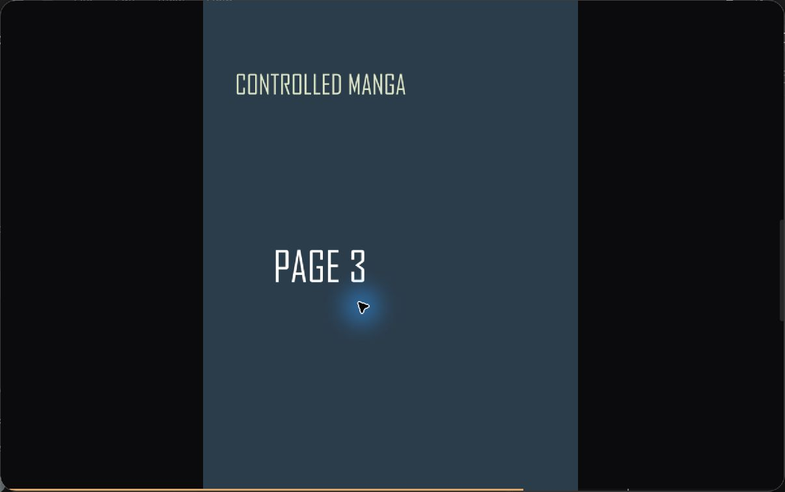

# Native evaluation captures

These captures show the Windows Tauri evaluation binary built from contribution commit `203997fa3d0b21e9914ad7b39d9a830d0630fd7d`, on official 0.9.127 base `770ca0bd4beec9584494bf5059e2314008c6bd41`. They do **not** show a native build of the later `e28bc25df122ef5b6a5b102a8ecc369ddb2d11fe` merge, whose Capstan staging is blocked by missing upstream build inputs.

All captures use the same 1206 by 755 window and default theme. The account is a disposable guest; the local video, manga pages, list names and collection names are synthetic. Public catalog artwork remains visible behind the membership menu. No personal accounts, access URLs or filesystem paths are shown.

## Scoped player menu

The menu belongs to the playing synthetic local file. It contains Settings and Live sync, with no Back cell, Go to, Refresh or global Continue last watched action. Copy magnet is absent because the selected file has no magnet source. Opening Live sync subsequently displayed the selected synthetic subtitle track; Escape closed that panel without leaving playback.

## Independent membership persistence

QA Local A was added independently to QA List Beta and QA Saved Source Copy. The submenu remained open after each change. This capture was taken after Ctrl+R and reopening the menu: both changes persisted, and the original list and collection memberships remained selected.

## Exact manga continuation

Resume reading opened the saved third page of the controlled local chapter. Adding the manga to favorites also survived Ctrl+R. This local-folder fixture does not verify provider-dependent download flows.

These are static after-state captures, not a matched before/after comparison or a motion recording. Full animation, final-merge native validation and additional platform checks remain review work before marking the pull request ready.
